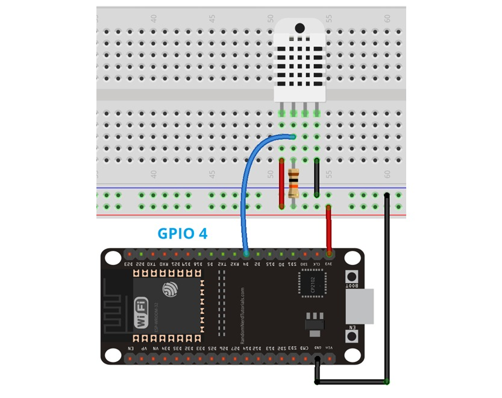
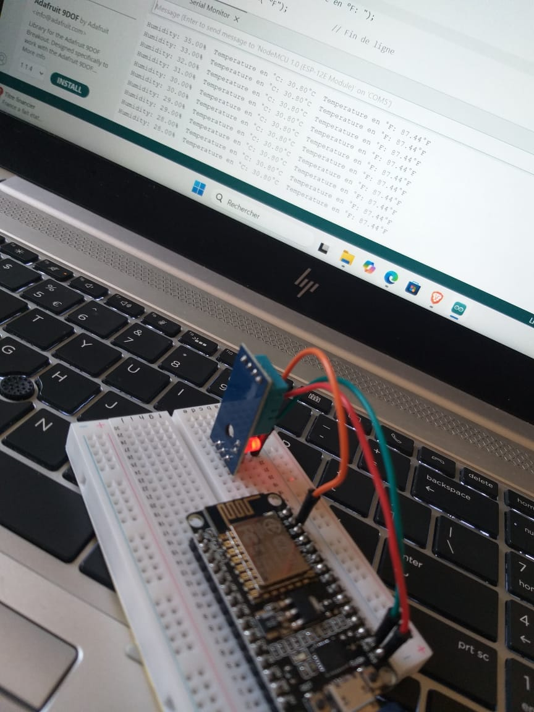
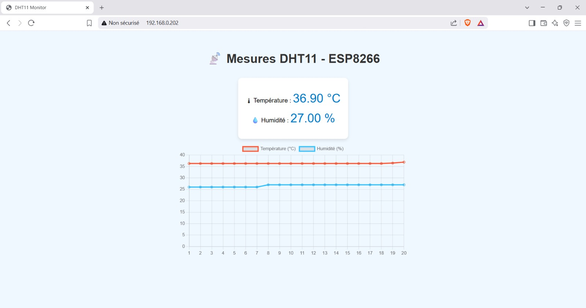
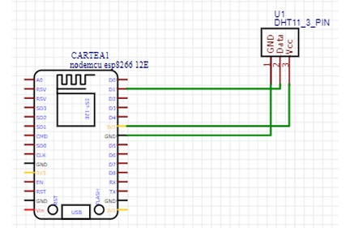
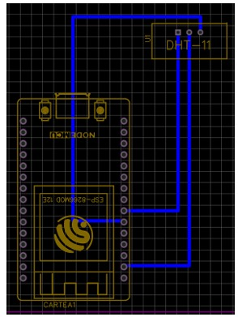
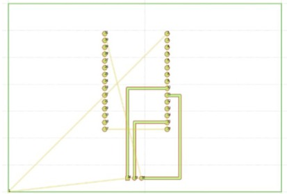
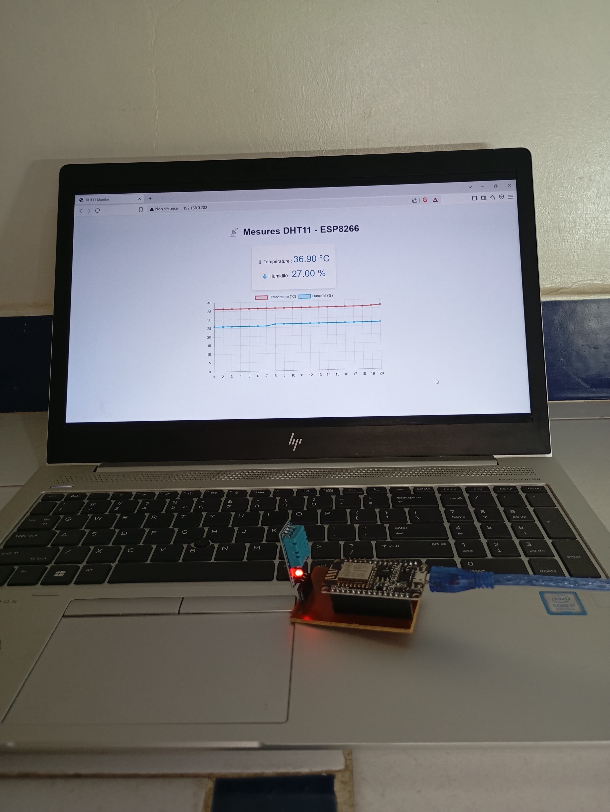

# 🌡️ IoT Temperature & Humidity Monitoring System

## 📝 Description :
Ce projet consiste à concevoir et réaliser un système IoT capable de mesurer la température et l’humidité en temps réel à l’aide d’un ESP8266 et d’un capteur DHT11, avec affichage via une interface Web.

## 👩‍💻 Réalisé par :
- El Azimani Chaimae
- Jihane Bouras

## 📌 Problématique :
La surveillance des conditions environnementales en temps réel est essentielle dans plusieurs domaines (santé, agriculture, domotique). Ce projet propose une solution connectée permettant de collecter et visualiser ces données à distance.

## 🎯 Objectifs :
- Mesurer la température et l’humidité
- Transmettre les données via Wi-Fi
- Afficher les données en temps réel sur une interface Web
- Concevoir un système stable via un PCB

## ⚙️ Fonctionnement :

- Le capteur DHT11 mesure la température et l’humidité
- L’ESP8266 traite les données
- Les données sont envoyées via Wi-Fi
- Une interface Web permet l’affichage en temps réel
- Une version avancée intègre des graphiques dynamiques
- 🚨 Une alerte Telegram est envoyée automatiquement si la température dépasse un seuil défini

## 🛠️ Partie Matérielle (Hardware) :

## 🔌 Composants utilisés :

- **ESP8266** (microcontrôleur avec Wi-Fi intégré)
- **Capteur DHT11** (température et humidité)
- **Breadboard** (phase de test)
- **PCB** (version finale)
- **Câbles de connexion**

## 🔗 Schéma de câblage :

## 💻 Partie Logicielle (Software) :

## 🧾 Outils utilisés :
| Logiciels | Utilisations |
|---|---|
| **Arduino IDE** | Programmation de l’ESP8266 |
| **EasyEDA** | Conception du PCB |
| **FlatCAM** | Génération des fichiers de fabrication PCB |
| **Chart.js** | Visualisation graphique des données |

## 🚨 Système d’alerte Telegram :

- Surveillance automatique de la température
- Seuil critique défini (ex : 35°C)
- Envoi d’une notification instantanée via Telegram
- Permet une réaction rapide en cas de dépassement

## ⚙️ Logique du système :

### 🔄 Version 1 — Affichage simple :
- Lecture des données du capteur
- Affichage sur le moniteur série
- Validation du fonctionnement

### 📊 Version 2 — Interface avancée :
- Affichage des données sur une page Web
- Intégration de graphiques dynamiques
- Mise à jour en temps réel
- Interface utilisateur améliorée

## 🔨 Réalisation du Prototype :

### Étape 1 — Test sur breadboard :

### Étape 2 — Développement Web :

### Étape 3 — Conception PCB :

  
  
  

### Étape 4 — Réalisation finale :

## 📊 Résultats :
- Système fonctionnel en temps réel
- Affichage des données via interface Web
- Visualisation graphique dynamique
- Solution stable après intégration PCB

## 🚀 Améliorations possibles :
- 📱 Développement d’une application mobile
- 🔐 Sécurisation des communications (HTTPS / MQTT)
- 📊 Stockage et analyse des données historiques
- 🤖 Détection intelligente des anomalies (IA)

## 🚀 Conclusion
Solution IoT simple, efficace et évolutive permettant la surveillance en temps réel des conditions environnementales.
